# AWS 기반 지속 가능한 데이터  분석하기

## 목차
- S3 + Glue를 이용하여 Datalake 구성하기
- EMR + Zeppelin을 통한 데이터 분석
- Tableau로 시각화 하기

## 개요
불과 수년전이지만 과거에는 빅데이터를 분석하는 것을 시도하는 자체가 어려운 일이었습니다. 데이터를 분석해서 의미를 도출해내는 작업 이전에 데이터 만지는데 전전긍긍하고 많은 시간을 쏟았습니다.

많이 들어보셨겠지만 하둡이나 스파크 같은 분산 프레임워크가 등장해서 이런 문제들을 해결해주었지만, 이것들을 셋업하고 운영하기에는 많은 시간과 노력이 필요했습니다. 다행히 Amazon EMR 같은 서비스가 등장하면서 이런 과정들을 간소화하고, 다른 리소스들과의 확장성을 갖춘 관리 형태로 제공하기 때문에 얼마든지 자신의 입맛에 맞는 분석 플랫폼을 구축할 수 있게 되었습니다.

이번 핸즈온을 통해 여러분들의 데이터를 Amazon EMR, Amazone S3 같은 서비스로 데이터 분석 아키텍쳐를 직접 구성해보고, 실제 업무에서 데이터 분석 업무가 어떻게 이뤄지는지 예제를 통해서 알아보겠습니다.

## 서비스소개
...
### Amazon S3
Amazon S3 is ...
### AWS Glue
AWS Glue is ...
### Amazon EMR
Amazon EMR is ...
### Amazon Athena
### Tableau
Tableau is ...

## EMR을 통해 분석환경 구축하기
시작하기에 앞서서 생성한 EMR 클러스터에 ssh 접속을 위해 EC2키페어를 생성합니다.
  - EC2 콘솔메뉴로 이동 (https://ap-northeast-2.console.aws.amazon.com/ec2/v2/home?region=ap-northeast-2)
  - *키페어* 메뉴에 *키페어 생성* 버튼을 눌러서 키페어를 생성합니다. 키페어 생성 즉시 브라우저에서 .pem 파일 하나가 다운로드 됩니다.
  
  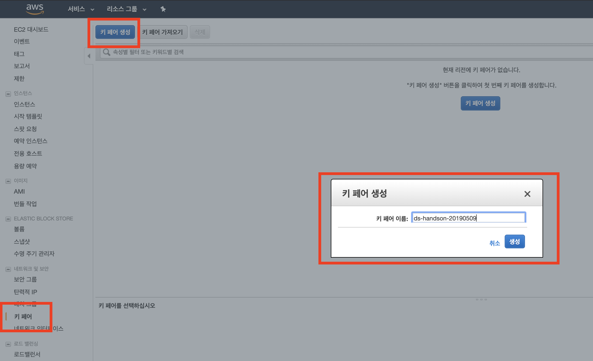
  
  - 아래 명령어로 pem 파일에 권한을 변경합니다.
  
  ```
  chmod 400 ds-handson-20190509.pem
  ```

  - pem키는 사용후 꼭 지우시거나 관리해주세요. git에 올리시면 안됩니다!

### 1. EMR 시작하기
- 콘솔에서 EMR 서비스로 이동합니다.
- 이전에 EMR 서비스를 사용해보시지 않으셨다면 아래와 같은 화면을 볼 수 있습니다.

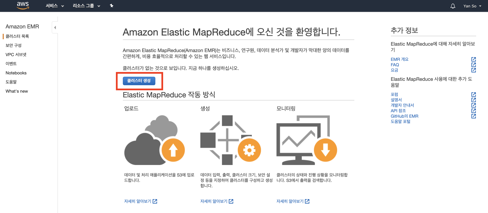

- *클러스터 생성* 버튼을 눌러 EMR을 생성해보겠습니다.
- EMR 클러스터 생성을 위한 환경설정 메뉴를 확인하실 수 있습니다.
  - 빅데이터 분석을 위해서 어떤 소프트웨어를 사용할 것인지 선택할 수 있습니다.
  - *데이터 메터 데이터에서 AWS Glue 데이터 카탈로그 사용* 이란 옵션이 있는데 추후에 Glue를 통해 생성한 데이터 카탈로그의 데이터들에 접근할 수 있습니다.
  - 하드웨어를 선택할 수 있습니다. 선택하시는 인스턴스에 따라 퍼포먼스와 비용에 영향을 줍니다.
  - 또한 좌측 상단에 보시면 *고급 옵션으로 이동*이란 메뉴가 있어서 원하시는 환경을 직접 선택하여 구성하실 수 있습니다.
  - *고급 옵션으로 이동*을 선택합니다.

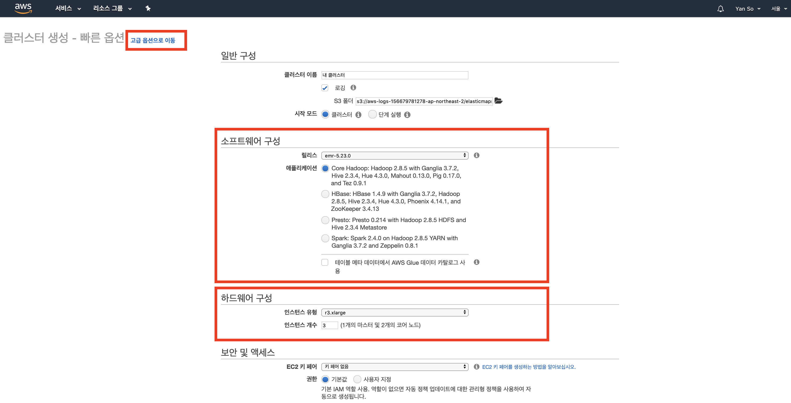

### 2. EMR 구성하기
- 소프트웨어 구성을 위한 화면입니다. 이전에 보았던 메뉴구성과 달리 원하시는 소프트웨어의 조합을 마음대로 구성하실 수 있습니다.
- Zeppelin과 Spark 환경을 구성하기 위해 *Hadoop 2.8.5, Zeppelin 0.8.1, Spark 2.4.0*을 선택하였습니다.
- AWS Glue 데이터 카탈로그 설정도 체크하였습니다.

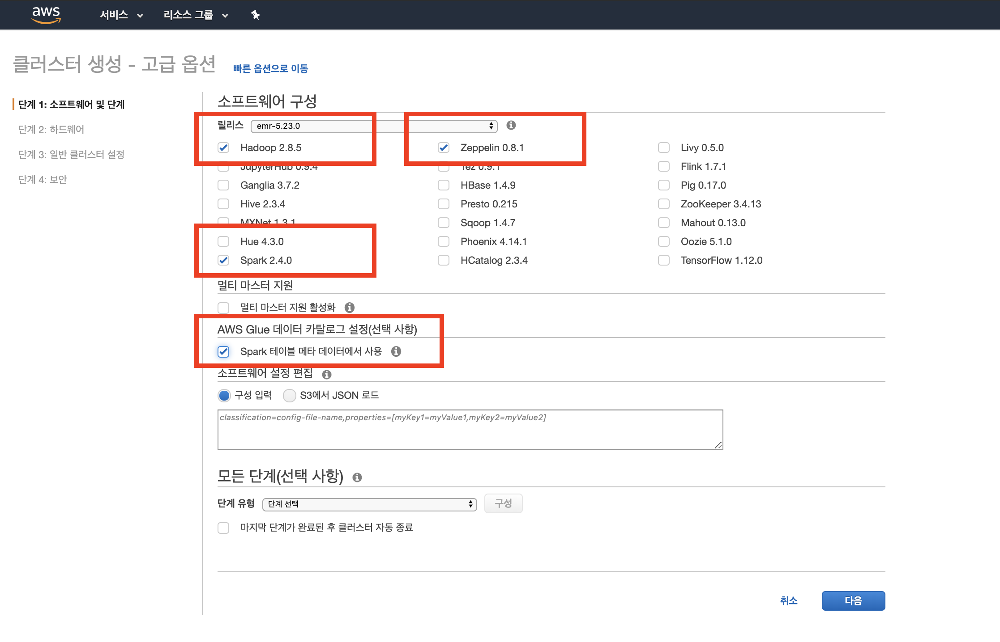

- 하드웨어 구성은 마스터노드 1개는 온디맨드 형태로, 코어노드 5개는 스팟 형태로 띄워보겠습니다.
- 마스터노드에는 Zeppelin을 포함한 여러가지 환경설정들이 저장되어 있어서, 마스터노드가 꺼질경우 전체 분석환경이 비활성화 된다고 생각하시면 됩니다. 반면에 실제 데이터들을 분산하여 처리하는 코어노드나 작업노드는 원하는 작업양 만큼 자유롭게 늘이고 줄이고하는 작업이 가능합니다.
- 코어노드나 작업노드는 비용을 고려하여 스팟 인스턴스 형태로 띄워도 무방합니다. 마스터노드도 스팟인스턴스로 띄워도 되긴 하지만 설명드린 것 처럼 마스터노드에 문제가 생기면 많은 귀찮고 어려운점들이 있으니 온디맨드로 사용하는 것을 권장합니다.

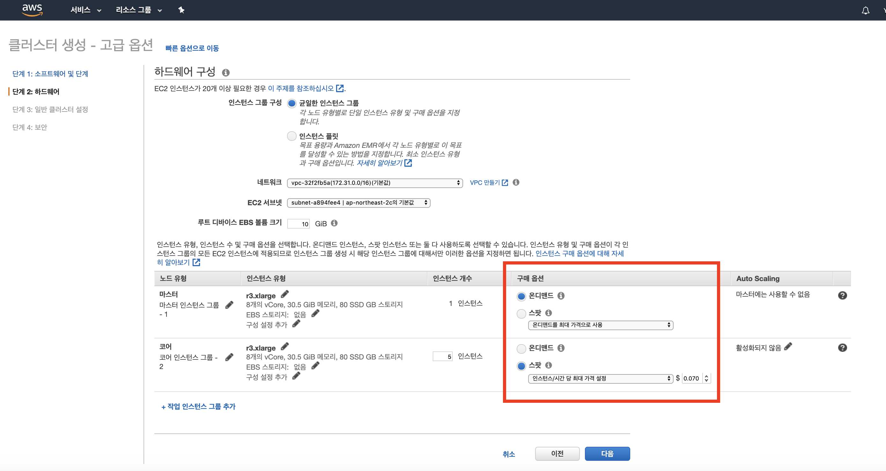

- 클러스터 이름을 입력하고 다음으로 넘어갑니다.

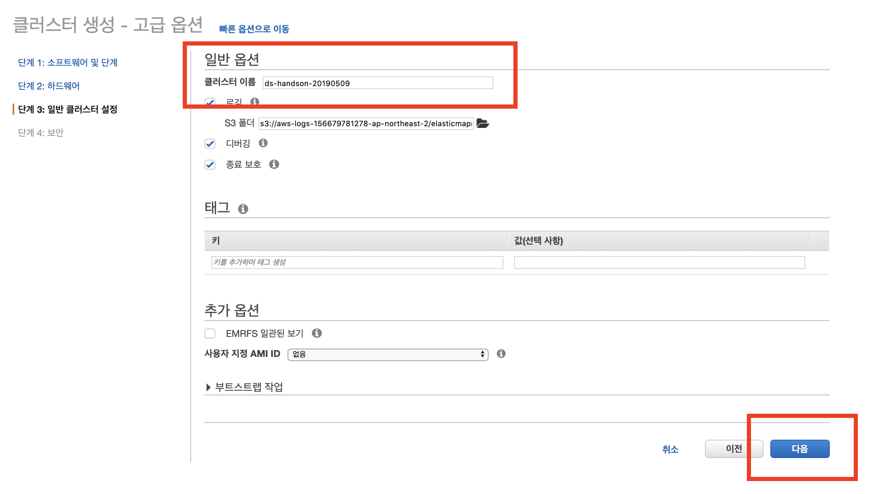

- 마지막 보안을 위한 설정입니다. 최초에 생성한 키페어를 선택하고 *클러스터 생성* 버튼을 누릅니다.
- 생성완료까지 수분이 소요됩니다.

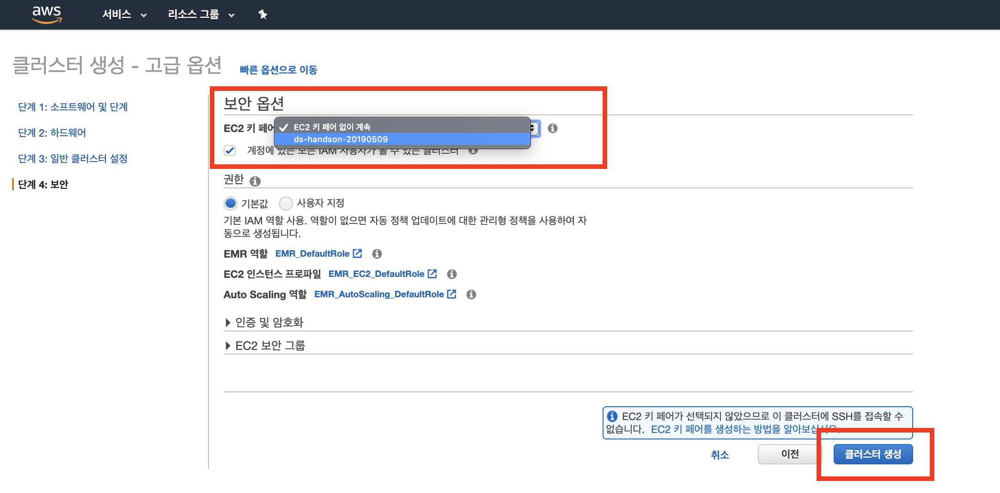

- EMR 클러스터 생성이 완료되면 아래와 같은 화면을 보실 수 있습니다.
- *마스터 퍼블릭 DNS*는 Zeppelin이나 ssh 접속 시 사용할 수 있습니다.
- *마스터 보안그룹*에서 보안그룹을 설정하여 접근권한을 제어할 수 있는데, 실습을 위해 현재 IP 기준으로 접근을 허가하도록 하겠습니다.


- *마스터 보안그룹*을 클릭하면 EC2 콘솔 보안 그룹 메뉴로 이동합니다.
- 스파크 마스터 보안그룹의 인바운드을 편집합니다.

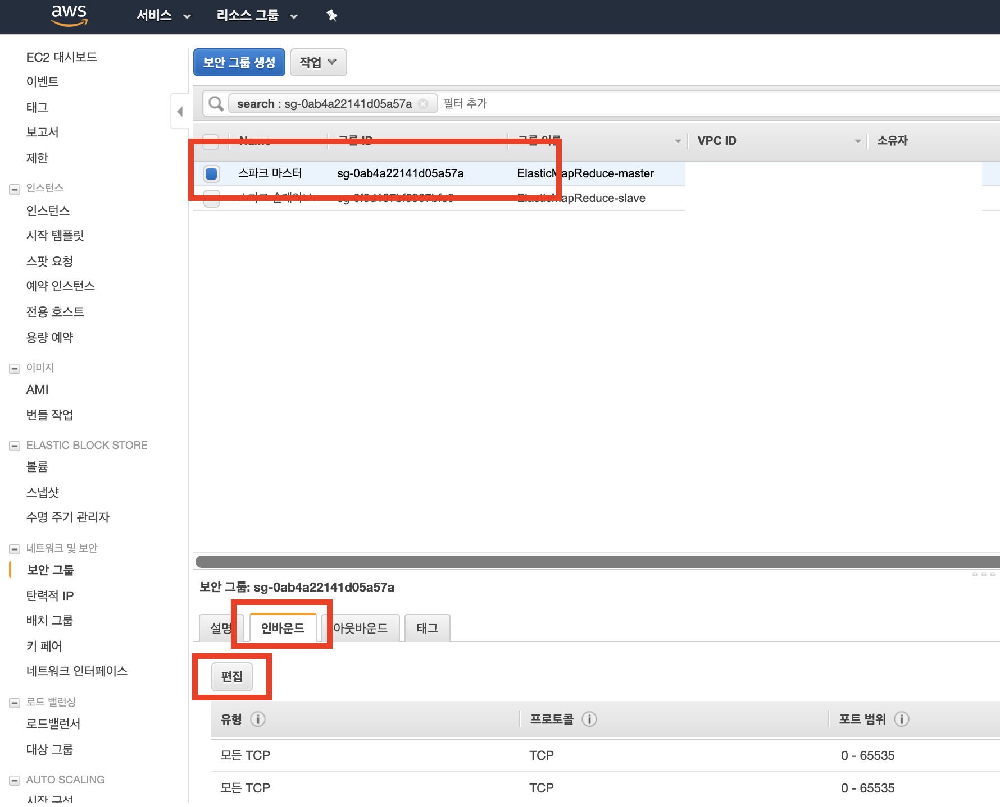

- 8890 포트 (Zeppelin 사용) 22 포트 (ssh 접속)을 사용하는 접근 가능한 소스에 *내 IP*를 설정합니다.

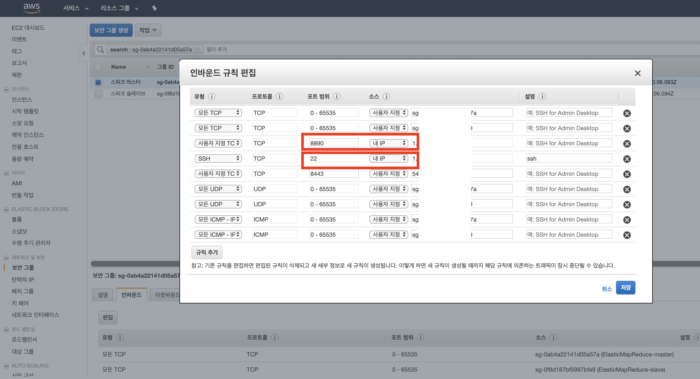

- 여기까지 모두 성공하셨다면 정상적을로 스파크 마스터노드 위에 셋팅된 Zeppelin에 접근이 가능합니다.

```
접속URL: http://[생성된 마스터 퍼블릭 DNS]:8890
ex) http://ec2-**-***-***-**.ap-northeast-1.compute.amazonaws.com:8890
```

- 데이터를 Zeppelin을 통해 만지기 전에 간다한 설정들을 해두겠습니다.
  - [간편 설정을 위한 쉘스크립트](https://github.com/awskrug/datascience-group/blob/master/workshop-sustainable_data_analysis/env_emr_spark_zeppelin.sh)를 Working Directory에 다운받습니다.
  - 설정에 필요한 명령어들 묶음인 쉘스크립트 파일을 업로드 합니다.
  
    ```
    mkdir ds_handson_20190509
    cd ./ds_handson_20190509
    scp -i [KEY_PAIR_PATH] ./env_emr_spark_zeppelin.sh hadoop@[MASTER_PUBLIC_DNS]:/home/hadoop/env_emr_spark_zeppelin.sh
    ```
  
  - 터미널에서 해당 마스터 노드에 ssh 접속합니다. 이전에 저장된 .pem 키를 사용합니다.
  
    ```
    ssh -i [KEY_PAIR_PATH] hadoop@[MASTER_PUBLIC_DNS]
    ```
  
  - ssh접속에 성공하였으면 아래 화면이 확인 가능합니다. ls 명령어를 통해 1번 과정에서 복사했던 쉘스크립트 파일이 확인 가능합니다.
  
  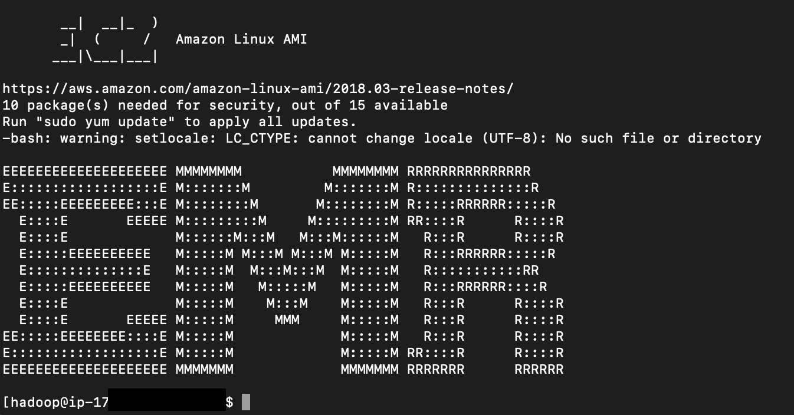
  
  - 쉘스크립트 실행합니다. Zeppelin ID는 ds_handson_20190509로 미리 설정했습니다. 쉘스크립트가 실행되면 Zeppelin 비번을 한번 입력해주셔야 합니다.

    ```
    sh env_emr_spark_zeppelin.sh
    ```
  
    설정 완료까지 수분이 소요됩니다.
  
- Zeppelin에 접속하여 id: ds_handson_20190509 pw: {입력하신 패스워드}로 접속이 정상적으로 되는지 확인합니다.
  
  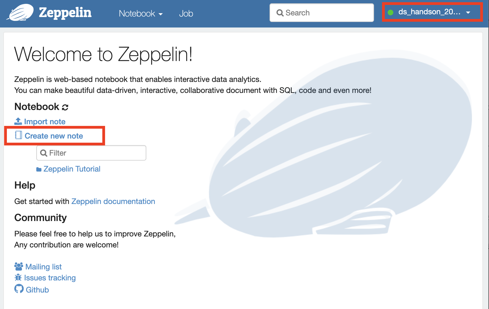

## 데이터셋 준비하기
핸즈온에 사용할 데이터는 [SKT Big Data Hub](https://www.bigdatahub.co.kr)에서 제공하는 배달업종 이용현황 분석 2018년 데이터입니다. 사이트에 가보시면 회원가입 후 직접 다운로드가 가능하며 공개된 다양한 종류의 데이터가 많으니 확인해보시기 바랍니다.

데이터는 미리 받아서 월별로 폴더트리를 만들어서 S3에 업로드 해두었습니다. EMR 마스터에 ssh 접속한 상태에서 아래 명령어를 통해서 여러분의 S3에 업로드하세요. EMR 마스터 인스터스에는 AWS CLI가 이미 셋업되어 있어서 바로 업로드가 가능합니다.

```
# Bucket 생성
aws s3 mb s3://[your_id]-ds-handson-20190509 --region ap-northeast-2

# 파일 업로드
aws s3 sync s3://data-ds-handson-20190509 s3://[your_id]-ds-handson-20190509/original_data --region ap-northeast-2

# 업로드 확인
aws s3 ls [your_id]-ds-handson-20190509/original_data/
```

위와 같이 *aws s3 ls* 명령어로 확인하거나 직접 S3 콘솔에서 파일이 업로드 되어있으면 준비가 완료 되었습니다.

## Zeppelin을 이용하여 데이터 전처리

데이터분석을 위해 EMR 설정도 완료했고, 데이터도 준비되었습니다. 이제 진짜로 데이터를 들여다보도록 하겠습니다. 핸즈온으로 준비한 데이터는 총 120mb 정도되는 작은 데이터이고 충분히 Google Spread Sheet 서비스나 엑셀로도 처리가 가능합니다. 이번 핸즈온에서는 실제로 빅데이터를 다루지는 않지만 어떻게 AWS 리소스를 이용하여 일반적인 워크스테이션이나 데이터베이스에서 처리할 수 없는 빅데이터를 분석할 수 있는지에 대한 접근방법을 익히는것이 중요한것임을 말씀드립니다. 

### 1. Zeppelin 시작하기
Zeppelin에 접속하여 노트북을 생성합니다.

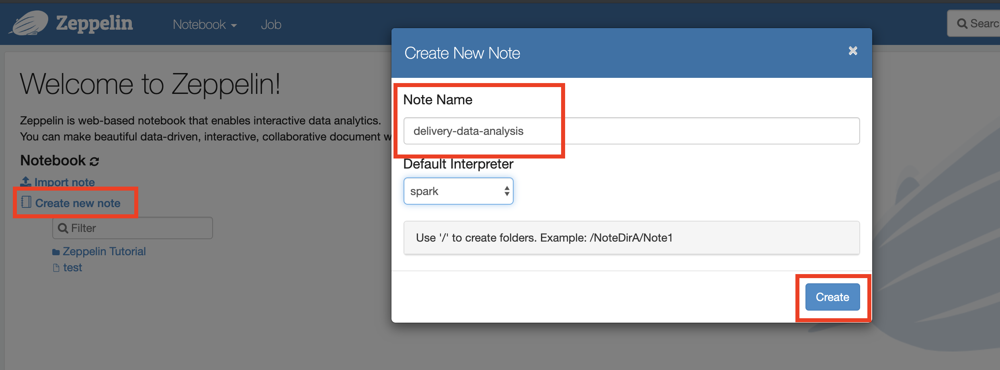

### 2. 데이터 불러오기 & 살펴보기
여기부터 진행되는 내용은 아래 코드블락을 Zeppelin 노트북에 복사&붙여넣기 해보시고 실행해보시면 됩니다.

- 자주쓰는 라이브러리 선언

  ```
  %pyspark

  from pyspark.sql.functions import *
  from pyspark.sql.types import *
  from pyspark.sql.window import Window
  import pandas as pd
  import numpy as np
  from urllib.parse import urlparse, parse_qs, unquote_plus, urlsplit
  from datetime import datetime, timedelta
  from dateutil.relativedelta import relativedelta
  import re
  import time
  import builtins
  ```

- S3 데이터 불러오기 (PySpark 이용)

  ```
  %pyspark

  dat = spark.read.csv("s3n://[your_id]-ds-handson-20190509/original_data/*", header = True)
  z.show(dat)
  ```
  
  
  
  (..데이터 설명..)
  
  요일별 분석을 위해 요일 정보가 있으면 좋겠습니다. [이 페이지](https://stackoverflow.com/questions/38928919/how-to-get-the-weekday-from-day-of-month-using-pyspark)를 참고하면 날짜에서 요일정보를 만들 수 있을 것 같습니다. 새로운 블록을 만들어서 아래와 같이 시도해봅니다.
  
  ```
  %pyspark
  
  dat = spark.read.csv("s3n://[your_id]-ds-handson-20190509/original_data/*", header = True)\
    .withColumn("dow_number", date_format('일자', 'u'))

  z.show(dat)
  ```
  
  새로 만든 "dayofweek" 열에 예상했던 요일정보가 없고 null 값으로 채워져 있습니다. 사용한 [date_format 관련 문서](https://spark.apache.org/docs/2.1.0/api/python/pyspark.sql.html)를 보면 입력값으로 date와 format을 받습니다. 저희가 넘겨준 '일자'칼럼을 date로 인식하지 못해서 발생한 문제인 것 같습니다.

  

### 3. 데이터 전처리

- '일자' 컬럼을 PySpark가 좋아하는 형태로 변환시킵니다. to_date 함수의 foramt 파라미터에 date 정보의 형태를 알려주면 date 형태로 정보를 올바르게 읽어옵니다.
- 그 후에 다시 date_format 함수를 이용하여 요일정보를 가져옵니다.

  ```
  %pyspark
  
  dat = spark.read.csv("s3n://[your_id]-ds-handson-20190509/original_data/*", header = True)\
    .withColumn("일자", to_date("일자", "yyyyMMdd"))\
    .withColumn("dow_number", date_format('일자', 'u'))\
    .withColumn("dow_string", date_format('일자', 'E'))
    
  z.show(dat)
  ```

  

- 이와같이 Zeppelin을 통해 데이터 전처리가 가능하고 간단한 분석 및 시각화도 
가능합니다.

  ```
  %pyspark

  result = dat\
    .groupBy("dow_number", "dow_string")\
    .agg(sum("통화건수").alias("통화건수"))\
    .sort("dow_number")
    
  z.show(result)
  ```
  
  
  

- 전처리 데이터 저장하기
날짜포맷을 바꾸고 요일정보를 추가한 데이터를 다시 S3에 적재합니다. 기존에는 *[your_id]-ds-handson-20190509* 버켓의 origianl_data 폴더에 1년치 데이터가  저장되어 있었는데요. 크게 문제가 되지 않을 파일 사이즈이지만, 만약 일별/월별로 적재되는 데이터의 사이즈가 크고 오랜기간 동안 데이터가 누적되었다면 그 데이터를 조회하는데만 큰 비용이 발생합니다. 효율적인 데이터 관리와 파티션이라는 개념을 향후에 사용하기 위해 폴더트리를 월단위로 변경하여 저장하겠습니다.

  ```
  %pyspark

  start_date = "2018-01-01"

  for mm in range(0, 12):
    dt = datetime.strptime(start_date, '%Y-%m-%d') + relativedelta(months = mm)
    date_yyyy_mm = "{:%Y-%m}".format(dt)
    date_simple = "{:%Y-%m-%d}".format(dt)
    print(date_yyyy_mm)

    result = dat\
        .filter(col("일자").startswith(date_yyyy_mm))\
        .repartition(1)\
        .write\
        .csv("s3n://[your_id]-ds-handson-20190509/result/{}".format(date_yyyy_mm), header=True, mode="overwrite")
  ```

해당 버켓의 result 폴더에 가보면 의도한대로 데이터가 월별로 폴더링 되어 적재되어 있습니다.


## AWS Glue를 이용하여 데이터 카탈로그 생성
1. Glue 크롤러를 이용해여 테이블 생성
2. 생성된 테이블 살펴보기
3. Amazon Athena에서 카탈로그를 통해 데이터 불러오기

## Tableau를 이용하여 시각화하기
1. Tableau에서 데이터 카탈로그 불러오기
2. 데이터 시각화하기

## 참고자료
AWS 기반 지속 가능한 데이터 분석 플랫폼 구축하기 (AWS Summit Seoul 2019)
: https://www.slideshare.net/awskorea/aws-aws-summit-seoul-2019-141290115
